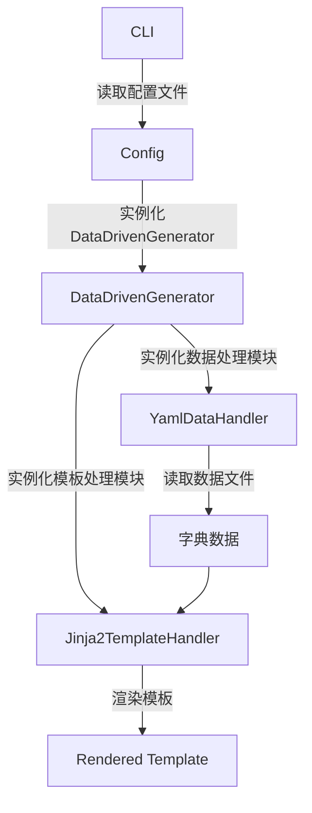

# 基础渲染示例

使用Yaml及Jinja2模板引擎进行基础的模板生成。
YamlHandler读取yaml文件生成字典数据，Jinja2TemplateHandler使用该字典数据渲染模板。

## 1.使用方法
```python
cli.py ./example_config.yaml
```

## 2.示例文件
### example_config.yaml
cli将使用命令行指定的配置文件进行处理。

```yaml
# 数据处理器配置
data_type: yaml # 使用Yaml作为数据处理器
data_config:
  root_path: .\expr_test\data  # 数据树根目录
  file_pattern: ["*.yaml"] # 匹配的文件模式
  preserved_template_key: "TEMPLATE" # 保留的模板键
  preserved_children_key: "CHILDREN" # 保留的子节点键

# 模板处理器配置
template_type: jinja # 使用Jinja2作为模板处理器
template_config:
  template_dir: .\expr_test\template # 模板目录
  preserved_children_key: "children_text" # Jinja2模板中保留的子节点键
  autoescape: false # 是否xml转义

# 要处理的入口文件
patterns:
  - "*.yaml" # 代表在data_config中指定的根目录下查找所有yaml文件

# 输出目录
output_dir: .\expr_test\output
```

### data.yaml
```yaml
TEMPLATE: template.j2
CHILDREN: 

paragrahs:
  - "Paragrah 1"
  - "Paragrah 2"
  - "Paragrah 3"

titles:
  Title1: hahaha
  Title2: ahahah
```

### template.j2

```jinja2
<html>
    
    <p>{{ paragrah }}</p>
    

    
    <h1>{{key}}</h1>
        <p>{{value}}</p>
    
</html>
```
## 3. 执行流程



## 4. 输出结果
```xml
<html>
    <p>Paragrah 1</p>
    <p>Paragrah 2</p>
    <p>Paragrah 3</p>

    <h1>Title1</h1>
        <p>hahaha</p>
    <h1>Title2</h1>
        <p>ahahah</p>
</html>
```