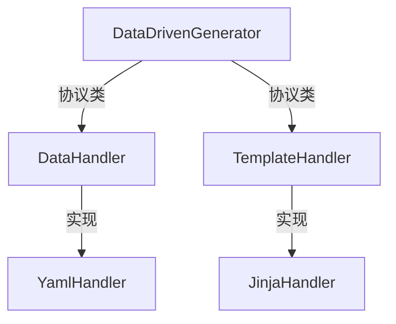

# 数据驱动模板生成器

## 1.概述
以Python为核心，基于python字典数据构建的树进行模板引擎生成。

## 模块说明
- **core** : 核心功能模块，提供数据处理和模板渲染的基础设施调度，其包括一个数据处理模块(DataHandler)和模板处理模块(TemplateHandler)。
- **node** : 定义了表达式节点和相关操作，支持复杂的表达式解析和计算。
- **yaml** : 处理YAML格式的数据，提供数据加载和转换功能。
- **jinja** : 集成Jinja2模板引擎，支持动态模板渲染。
- **test** : 包含测试用例和示例，验证核心功能和表达式解析的正确性。

